# Breaking News :newspaper::mega:

## Projeto Final desenvolvido na 18ª Semana de aulas do curso de Desenvolvimento Web Front-End da 10ª Turma da Reprograma :purple_heart:

## Índice

1. [Definição do Produto](#dart-definição-do-produto)
2. [Protótipos](#art-protótipos)
3. [Como usar?](#gear-como-usar)
4. [Tecnologias utilizadas](#robot-tecnologias-utilizadas)
5. [Estrutura dos Principais Arquivos](#file_folder-estrutura-dos-principais-arquivos)
6. [Resultados](#%EF%B8%8F-resultados)
7. [Sobre a desenvolvedora](#woman_technologist-sobre-a-desenvolvedora)

---
## :dart: Definição do Produto

O ***Breaking News*
** foi desenvolvido com o objetivo disponibilizar as últimas notícias do Brasil para o usuário. Para isso, esta aplicação tem a missão de prover informações atualizada de forma dinâmica e divertida para que estas sejam visualizadas diariamente.

O seu design foi desenvolvido em mobile first e também é responsivo para desktop(1366px) e tablet (768px), o que proporcional a versatilidade desejada pelos usuários. A sua idealização foi feita a partir de alta fidelidade que nortearam a construção do site de acordo com as necessidades dos clientes. Nele, é possível buscar as notícias pelos seus títulos, acessar uma outra página exclusiva para as Manchetes Diárias e ainda se divertir com a página reservada para as Frases do Dia onde são exibidas mensagens e imagem de forma dinâmica.

Por fim, é importante ressaltar que esse projeto foi construído com base no planejamento realizado no [Trello](https://trello.com/b/yWKMWvpd/projeto-final).

---
## :art: Protótipos
* ####  Mobile (375px)
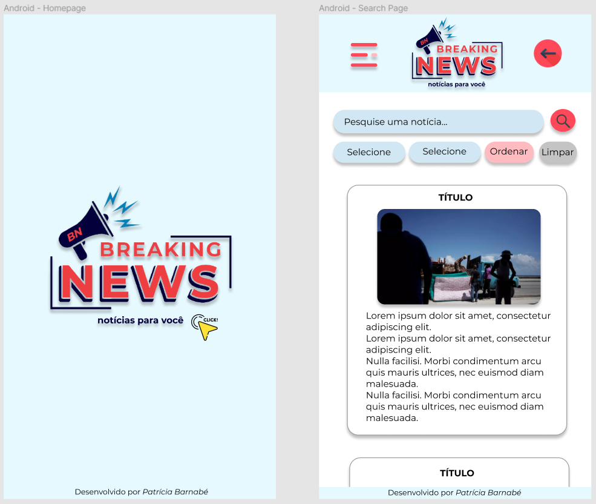

* #### Tablet (768px)
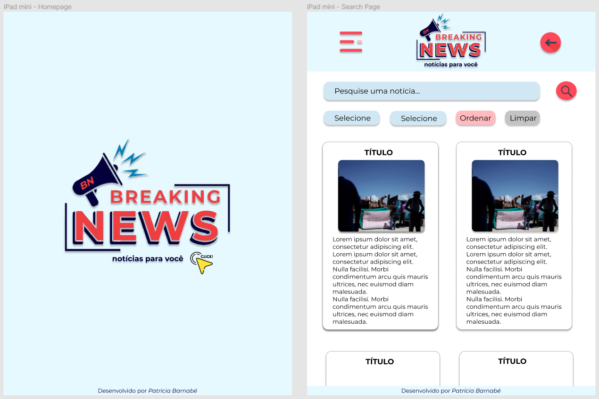

* #### Desktop (1366px)
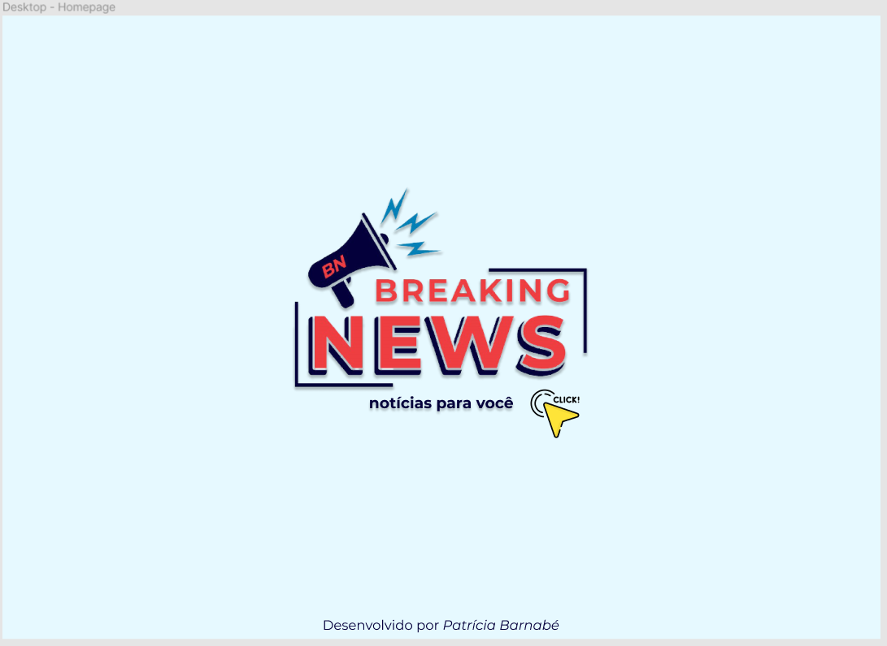
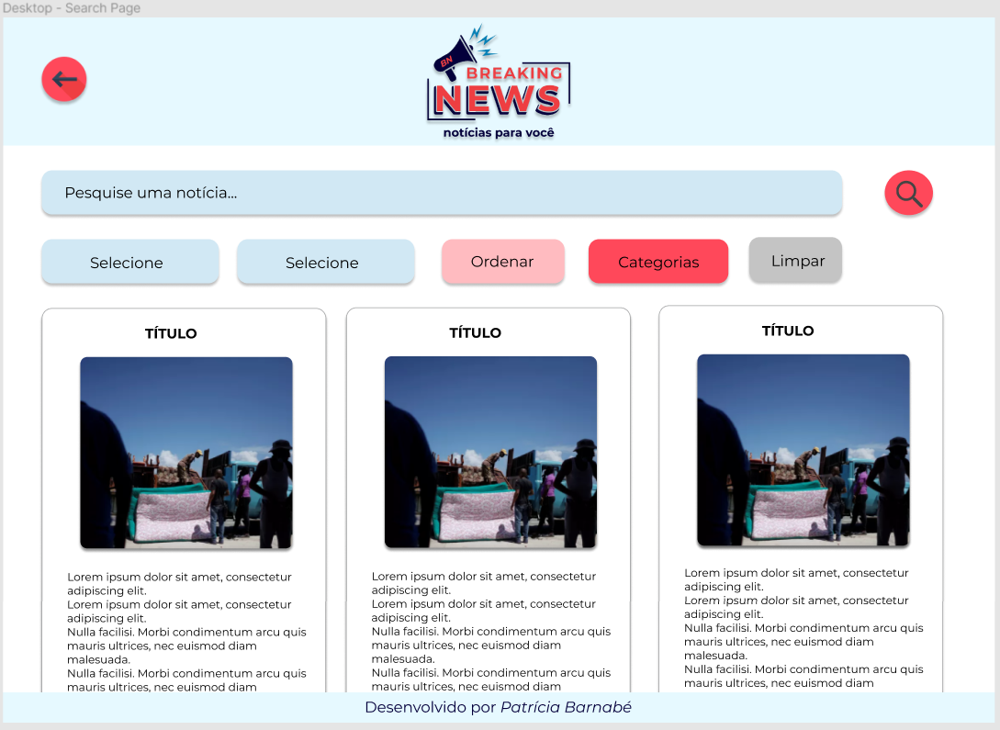

---
## :gear: Como usar?
- Primeiramente o usuário acessará a página inicial, na qual, o acesso para à página de notícias ocorre ao clicar na logo, no texto ou na imagem de click;

### Na página de notícias:
- O usuário é capaz de buscar uma notícia pelo seu respectivo título no campo "Pesquise uma notícia"; 
- Ao passar o mouse em cima dos cards, os mesmos irão girar e informações adicionais serão exibidas. Quando isso ocorre, o usuário pode visualizar a **data e hora da publicação**, o **link** oficial das notícias, bem como um trecho do **conteúdo** da notícia;
- Uma página de **Manchetes Diárias** pode ser acessada ao clicar no respectivo botão e mostrará as principais notícias do dia, além de possuir a mesma interação de informações adicionais que são exibidas atrás dos cartões das notícias ao passar o mouse por cima;
- Outra página de **Frases do Dia**, também acessível por seu respectivo botão, mostrará imagens e frase de forma dinâmica. Além disso, o usuário poderá mudar a imagem e a frase, ou apenas mudar a frase, apenas clicando nos botões de *Clique aqui para mudar somente a frase* ou *Clique aqui para mudar a frase e a imagem*.

---
## :robot: Tecnologias utilizadas

| Ferramenta | Descrição |
| --- | --- |
| `HTML 5` | Linguagem de marcação |
| `CSS3` | Linguagem de estilização |
| `JavaScript` |  Linguagem de programação interpretada estruturada|
| `React` | Biblioteca de JavaScript|
| `Node.js` | Software de execução de códigos JavaScript|
| `Git e GitHub` | Sistemas de controle de versões distribuídos|

---

## :file_folder: Estrutura dos Principais Arquivos
```
📁 projeto-final-news
|
|-  📁 src
|    |
|    |- 📁 assets
|    |     |- 📄 images...
|    |
|    |- 📁 components
|    |     |- 📁 Banner 
|    |     |       |- 📄 index.js
|    |     |       |- 📄 styles.css
|    |     |- 📁 Footer 
|    |            |- 📄 index.js
|    |            |- 📄 styles.css
|    |
|    |- 📁 pages
|    |     |- 📁 Advices 
|    |     |       |- 📄 index.js
|    |     |       |- 📄 styles.css
|    |     |- 📁 Headlines 
|    |     |       |- 📄 index.js
|    |     |       |- 📄 styles.css
|    |     |- 📁 Home 
|    |     |       |- 📄 index.js
|    |     |       |- 📄 styles.css
|    |     |- 📁 Search 
|    |            |- 📄 index.js
|    |            |- 📄 styles.css
|    |
|    |- 📁 routes
|    |     |- 📄 Routes.js 
|    |
|    |- 📄 App.js
|    |- 📄 index.js
|    |- 📄 global.css
|    |- 📄 README.md


```
## ✔️ Resultados
* ####  Mobile First (375px)

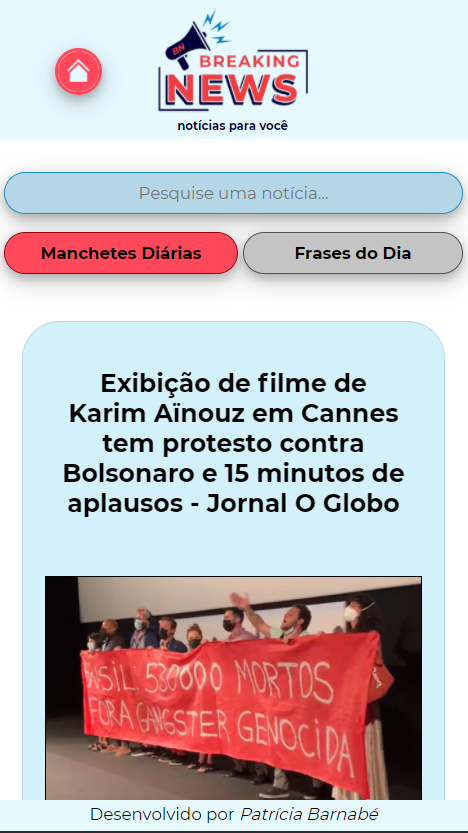


* #### Tablet (768px)

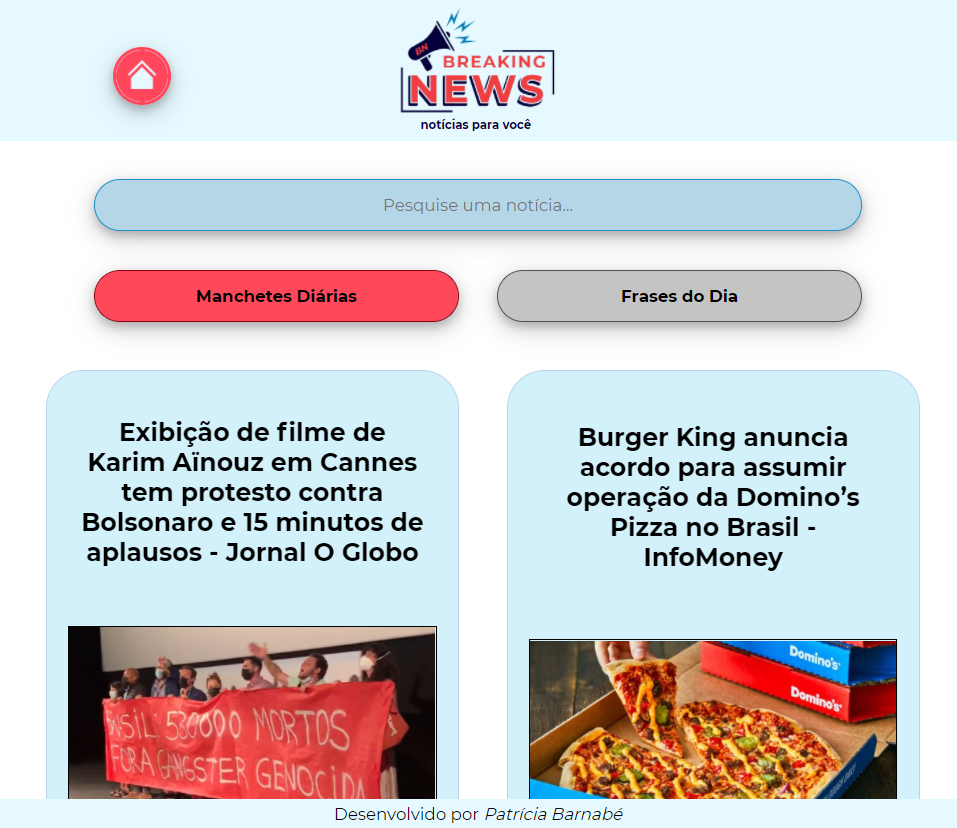
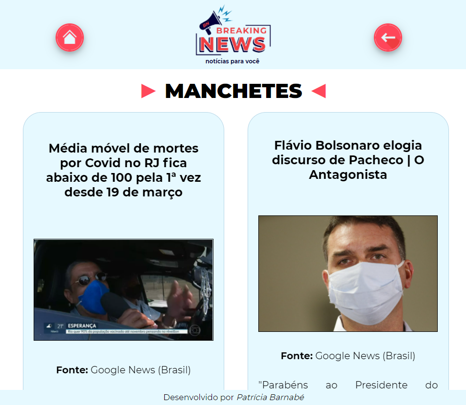
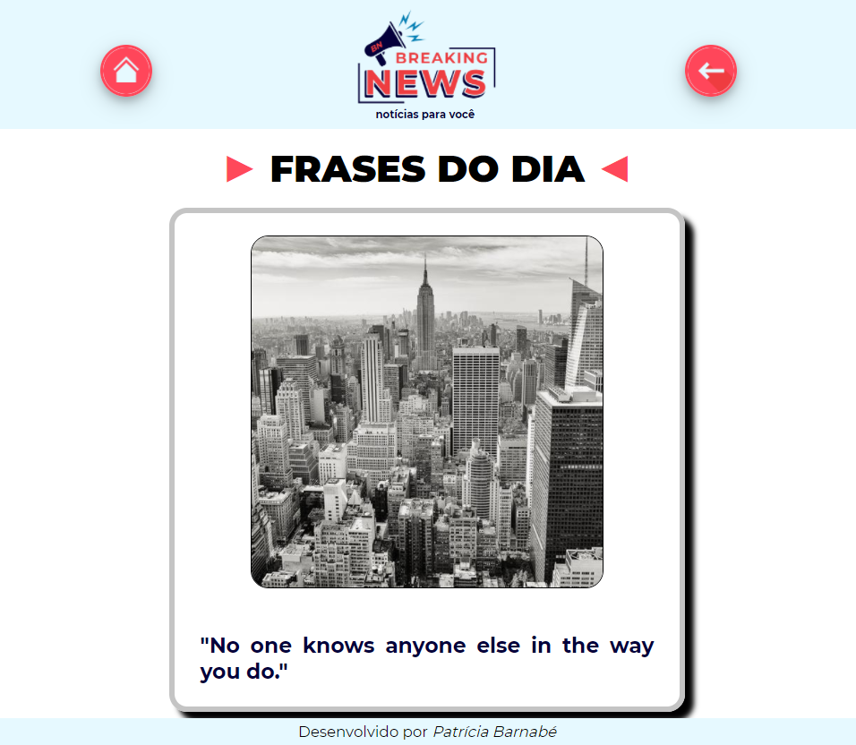

* #### Desktop (1366px)

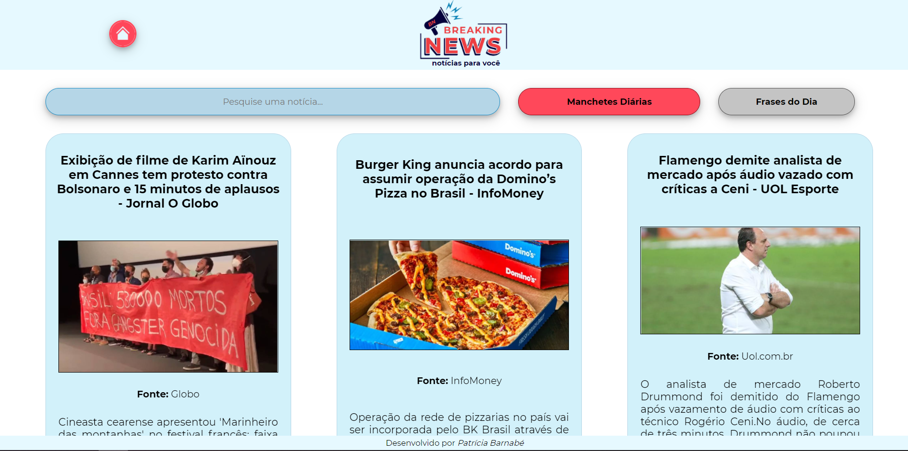
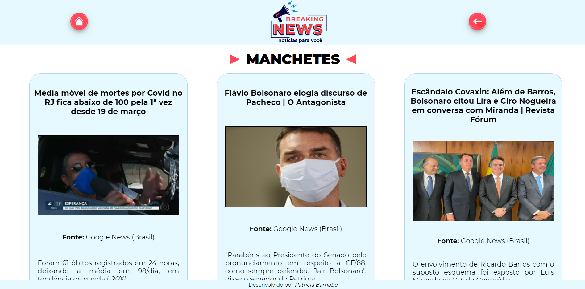
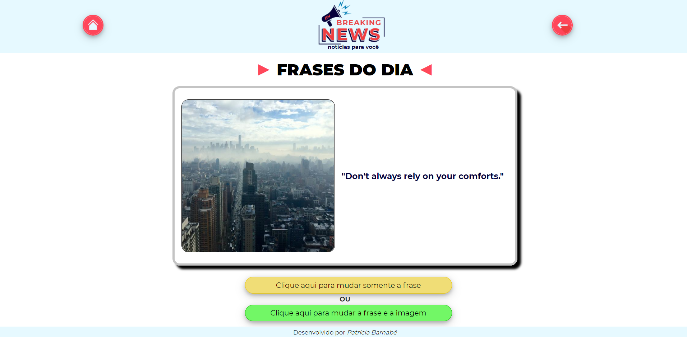

---
## :woman_technologist: Sobre a desenvolvedora
### Patrícia Barnabé

- [LinkedIn](https://www.linkedin.com/in/patriciabarnabe)
- E-mail: patbarnabe5@gmail.com
